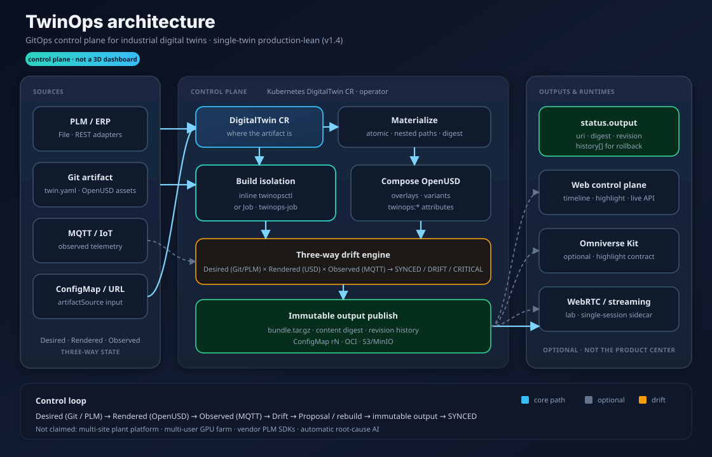
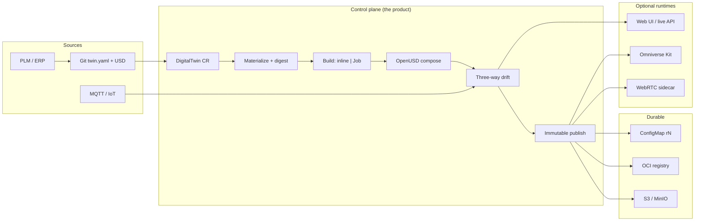

# TwinOps

**GitOps Control Plane for Industrial Digital Twins**

TwinOps is a **stable reference architecture** that reconciles **PLM metadata**, **OpenUSD scene composition**, and **live telemetry** into a versioned, observable digital-twin runtime.

> Status: **v1.4.0** — single-twin production-lean: immutable output revisions (ConfigMap/OCI/S3), isolated Job builds, deterministic USD bundles. Omniverse Kit optional. Not a multi-site plant platform.

[](https://github.com/justrunme/twinops-control-plane/actions/workflows/ci.yml)
[](https://github.com/justrunme/twinops-control-plane/releases/latest)
[](LICENSE)
[](#2-minute-live-demo)
[](docs/operator.md)
[](docs/operator.md)
[](#roadmap)

---

## Architecture

<p align="center">
  
</p>

<p align="center"><em>Control plane first: materialize → compose (inline or Job) → three-way drift → immutable output revisions. Kit / WebRTC are optional runtimes.</em></p>

<details>
<summary><strong>Animated lifecycle</strong> (demo narrative)</summary>

<p align="center">
  
</p>

<p align="center"><em>Desired PLM/Git → Rendered OpenUSD → Observed telemetry → Drift → Reconcile → SYNCED<br/>
(<a href="docs/assets/twinops-lifecycle.mp4">MP4</a> for smoother local playback)</em></p>

</details>



Full one-pager: [docs/architecture-one-pager.md](docs/architecture-one-pager.md) · operator: [docs/operator.md](docs/operator.md) · release: [docs/release-1.4.md](docs/release-1.4.md)

---

## Why this exists

Most Omniverse demos show a beautiful 3D scene.  
Most Kubernetes demos show Helm, Terraform, and autoscaling.

TwinOps is **not** “Omniverse in Kubernetes” and **not** “USD files + Grafana”.
It is a **control plane**: reconcile desired PLM / rendered OpenUSD / observed
telemetry into GitOps artifacts, then drive optional runtimes (Kit, web UI,
lab WebRTC) through a stable highlight contract — including on a laptop without a GPU.

TwinOps connects both worlds:

| DevOps                | TwinOps                   |
| --------------------- | ------------------------- |
| Kubernetes manifest   | DigitalTwin manifest      |
| container image       | USD asset                 |
| configuration overlay | USD layer                 |
| environment           | scene variant             |
| GitOps reconciliation | stage composition         |
| deployment rollout    | twin revision rollout     |
| runtime metrics       | telemetry and scene state |
| drift detection       | PLM / scene / IoT drift   |
| rollback              | previous USD composition  |

The distinctive feature is **three-way drift detection** (see diagram above):

| Plane | Source | Role |
| ----- | ------ | ---- |
| **Desired** | Git + PLM mappings | Engineering intent |
| **Rendered** | Composed OpenUSD | What the twin scene encodes |
| **Observed** | MQTT / IoT | Live factory signal |

Frozen contracts: [docs/stability.md](docs/stability.md).

---

## 2-minute live demo

No GPU required.

```bash
git clone https://github.com/justrunme/twinops-control-plane.git
cd twinops-control-plane
make install
make live-demo
```

Open **http://127.0.0.1:8080/**

```text
1. Trigger heat spike      → CRITICAL / DRIFT + scene highlight
2. Apply reconciliation    → USD overlay + healed telemetry
3. Twin returns to SYNCED  → timeline + mock Kit viewport calm
```

Smoke check without a browser:

```bash
make live-demo-smoke
```

Canonical productization scenario (persist + replay + artifacts):

```bash
make e2e-demo
make streaming-sidecar-smoke
```

Full walkthrough: [docs/demo.md](docs/demo.md) · [docs/e2e-demo.md](docs/e2e-demo.md) · [docs/streaming-sidecar.md](docs/streaming-sidecar.md)

---

## Quickstart extras

### Offline CLI demo

```bash
make demo
```

Produces composed USDA layers, a drift HTML report, and a GitOps reconciliation proposal.

### MQTT publish + ingest

```bash
make mqtt-smoke
twinopsctl mqtt topics
```

Starts Mosquitto, publishes simulator telemetry, injects an external PLC heat spike, and asserts CRITICAL drift.
Topic catalog: `examples/assembly-line/mqtt-topics.json` / `GET /api/mqtt/topics`.

### Mock PLM adapter

```bash
twinopsctl plm show
twinopsctl plm get 1004711 --catalog examples/assembly-line/plm-catalog.json
twinopsctl plm compare
```

See [docs/plm-adapter.md](docs/plm-adapter.md).

### Omniverse highlight contract (no GPU)

```bash
make serve
# other terminal:
make scene-live      # fetch + validate /api/scene
make scene-highlight # Kit stub client
make scene           # offline JSON + HTML highlight report
```

See [docs/omniverse.md](docs/omniverse.md).

### Local DX probes

```bash
make doctor
make live-status
make timeline
twinopsctl proposal
twinopsctl live spike
twinopsctl live reconcile
twinopsctl incident export --from-url http://127.0.0.1:8080 --out /tmp/incident.json
twinopsctl incident replay examples/assembly-line/incident-heat-spike.json \
  --desired examples/assembly-line/desired.usda \
  --stage examples/assembly-line/generated/root.usda \
  --observed examples/assembly-line/observed.json --json
make scene-live
twinopsctl openapi --out /tmp/twinops-openapi.json
make verify-all
```

Docs index: [docs/README.md](docs/README.md). Security: [SECURITY.md](SECURITY.md).

### Dev UI (Vite hot reload)

```bash
make serve      # terminal 1 — API :8080
make web-dev    # terminal 2 — UI  :5173
```

### Kubernetes operator

```bash
make operator-demo              # out-of-cluster manager (k3d/kind)
make operator-incluster-e2e     # docker build → kind load → Helm → restart recovery
make operator-demo-cleanup
```

In-cluster path publishes a durable `bundle.tar.gz` on the twin (`status.output.uri`).
See [docs/operator.md](docs/operator.md), [docs/images.md](docs/images.md).

### Tests

```bash
make test
make go-test
make verify-all
```

See [CONTRIBUTING.md](CONTRIBUTING.md).

---

## Two documents, two roles

TwinOps uses the same `apiVersion` family for two **different** documents. Do not mix them up.

### 1) Twin **manifest** (compiler input — lives *inside* the artifact)

Stored as `twin.yaml` in a ConfigMap / tarball. Consumed by `twinopsctl build`.

```yaml
# twin.yaml — what to compose (OpenUSD + PLM + telemetry mappings)
apiVersion: twinops.io/v1alpha1
kind: TwinManifest   # conceptual name; file may say DigitalTwin historically
metadata:
  name: assembly-line-a
spec:
  source:
    baseStage: assets/root.usda   # nested paths preserved in URL/tar artifacts
  configuration:
    variant: high-throughput
  telemetry:
    provider: mqtt
    endpoint: mqtt://factory-broker
    mappings:
      - topic: factory/robot-01/temperature
        prim: /World/Factory/LineA/Robot01
        attribute: twinops:temperature
  plm:
    provider: mock
    mappings:
      - itemId: "1004711"
        revision: "C"
        prim: /World/Factory/LineA/Robot01
```

### 2) DigitalTwin **CR** (Kubernetes — tells the operator *where* the artifact is)

```yaml
# DigitalTwin CR — operator control loop, not the scene itself
apiVersion: twinops.io/v1alpha1
kind: DigitalTwin
metadata:
  name: assembly-line-a
  namespace: twinops-system
spec:
  artifactSource:
    configMapName: assembly-line-inputs   # or url: https://…/bundle.tar.gz
    # expectedDigest: sha256:…
  intervalSeconds: 30
  # outputPublish.enabled defaults true → status.output.uri = configmap://…/assembly-line-a-output
```

The compiler turns the **manifest** into OpenUSD overlay layers with `twinops:*` attributes.  
The **CR** drives materialize → build → drift → durable `bundle.tar.gz` publish.

---

## Repository layout

```text
twinops-control-plane/
├── python/twinops/          # Compiler, drift, live API, PLM mock, CLI
├── examples/assembly-line/  # Demo factory line + sample USDA + PLM/MQTT catalogs
├── scripts/                 # live-demo / mqtt-smoke / operator-demo / sync helpers
├── docs/                    # Architecture, USD model, ADRs, roadmap
├── api/                     # DigitalTwin CRD types (Go)
├── controllers/             # Kubernetes operator controllers
├── cmd/manager/             # Operator manager entrypoint
├── deploy/helm/             # Helm chart for the operator
├── Dockerfile.live          # Demo live API + web UI image
├── Dockerfile.operator      # Operator manager image
├── extensions/              # Omniverse Kit highlight stub
├── usd/                     # Generated / shared USD workspace
└── web/                     # Live control-plane UI + mock Kit viewport
```

Compiler, drift engine, operator, GitOps, observability, and mock adapters run **without an NVIDIA GPU**. A GPU is required only for Kit rendering and the host NVENC streaming bridge.

---

## Demo story: Self-Healing Production Line

```text
Robot → Conveyor → Scanner → Packaging
```

1. Change desired robot revision in Git  
2. TwinOps compiles a new USD overlay layer  
3. Drift engine compares desired / rendered / observed state  
4. Scene metadata highlights revision or telemetry drift  
5. A reconciliation proposal restores the desired composition  

Milestones 1–2 deliver composition, drift detection, HTML report, and a reconciliation proposal. The Kubernetes operator reconciles `DigitalTwin` CRs via `twinopsctl`.

---

## Roadmap (summary)

| Track | Focus | Status |
| ----- | ----- | ------ |
| 0–5 | Compiler, drift, live API, web demo | **done** |
| Operator | CRD, Helm, durable ConfigMap output, in-cluster E2E | **done (1.3.1)** |
| Kit / media | Highlight contract, lab WebRTC, single-session NVENC ingest | **lab / optional** |
| Next | OCI output artifacts, isolated reconcile jobs | planned (1.4+) |

See full [docs/roadmap.md](docs/roadmap.md) and [docs/architecture.md](docs/architecture.md).

---

## What we will not claim yet

Honest positioning: **single-twin pilot / reference control plane**, not a plant platform.

This project does **not** claim:

- multi-site / multi-tenant enterprise readiness
- NVCF or production Omniverse App Streaming
- vendor-specific PLM product SDKs (generic File/REST adapters only)
- multi-user GPU streaming farm

PLM integration ships as **mock + File/REST adapters**.

---

## License

Apache License 2.0 — see [LICENSE](LICENSE).
