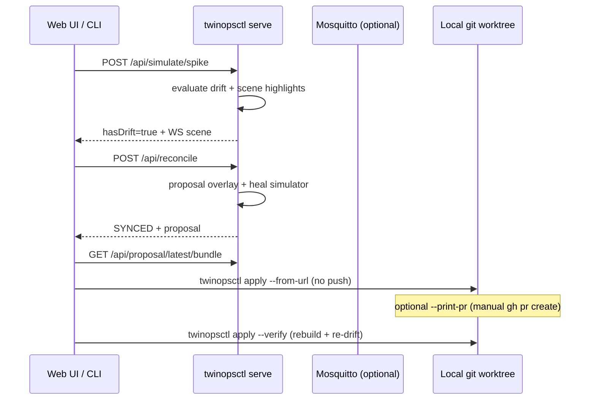
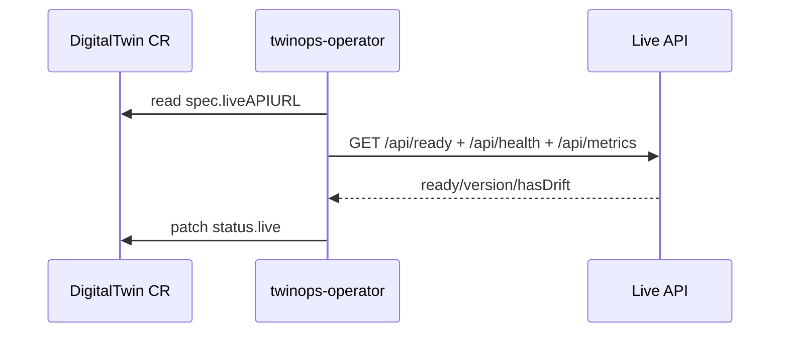

# TwinOps sequence diagrams

## Live spike → reconcile → apply

```mermaid
sequenceDiagram
  participant UI as Web UI / CLI
  participant API as twinopsctl serve
  participant MQTT as Mosquitto (optional)
  participant Git as Local git worktree

  UI->>API: POST /api/simulate/spike
  API->>API: evaluate drift + scene highlights
  API-->>UI: hasDrift=true + WS scene
  UI->>API: POST /api/reconcile
  API->>API: proposal overlay + heal simulator
  API-->>UI: SYNCED + proposal
  UI->>API: GET /api/proposal/latest/bundle
  UI->>Git: twinopsctl apply --from-url (no push)
  Note over Git: optional --print-pr (manual gh pr create)
  UI->>Git: twinopsctl apply --verify (rebuild + re-drift)
```

## Operator live probe

```mermaid
sequenceDiagram
  participant CR as DigitalTwin CR
  participant Op as twinops-operator
  participant API as Live API

  Op->>CR: read spec.liveAPIURL
  Op->>API: GET /api/ready + /api/health + /api/metrics
  API-->>Op: ready/version/hasDrift
  Op->>CR: patch status.live
```
